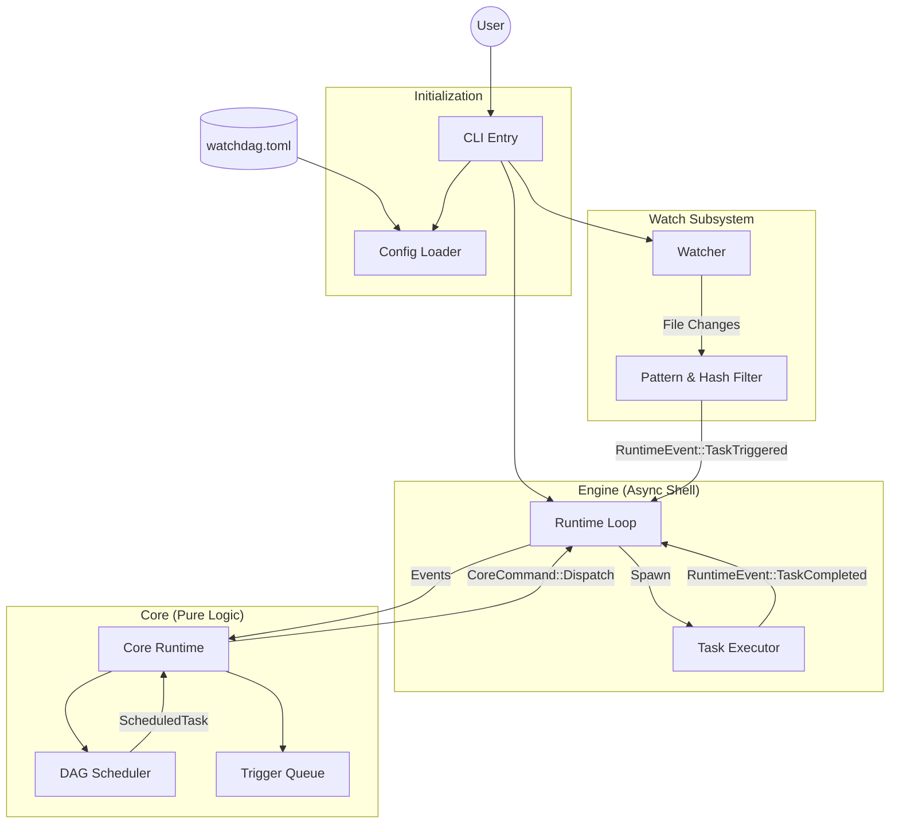

CLI utility to run commands based on watching files.
Runs commands in parallel and in series defined by DAG in Watchdag.toml

## Architecture

```mermaid
graph TD
    User((User)) --> CLI
    ConfigFile[(watchdag.toml)] --> Config

    subgraph "Initialization"
        CLI[CLI Entry]
        Config[Config Loader]
    end

    subgraph "Watch Subsystem"
        Watcher[Watcher]
        Filter[Pattern & Hash Filter]
    end

    subgraph "Engine (Async Shell)"
        Runtime[Runtime Loop]
        Executor[Task Executor]
    end

    subgraph "Core (Pure Logic)"
        CoreRuntime[Core Runtime]
        Scheduler[DAG Scheduler]
        Queue[Trigger Queue]
    end

    %% Flow
    CLI --> Config
    CLI --> Runtime
    CLI --> Watcher

    Watcher -- "File Changes" --> Filter
    Filter -- "RuntimeEvent::TaskTriggered" --> Runtime

    Runtime -- "Events" --> CoreRuntime
    CoreRuntime --> Queue
    CoreRuntime --> Scheduler
    
    Scheduler -- "ScheduledTask" --> CoreRuntime
    CoreRuntime -- "CoreCommand::Dispatch" --> Runtime
    
    Runtime -- "Spawn" --> Executor
    Executor -- "RuntimeEvent::TaskCompleted" --> Runtime
```
